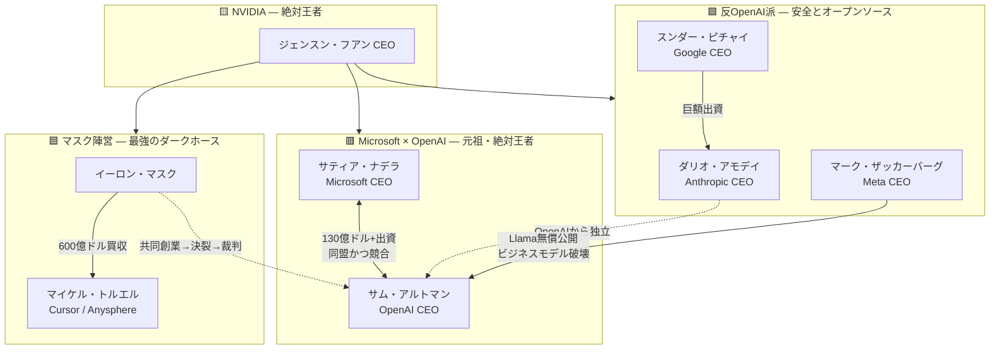

# 第3部：AI帝国・戦国時代の相関図と勢力争い

> **学習目標：** 4つの陣営と NVIDIA という「絶対王者」の関係を理解し、なぜ今の AI 業界が「戦国時代」と呼ばれるのかを説明できる

---

## 全体像：4層構造

現代の AI 業界は、大きく **3つの陣営** と、すべての陣営に武器（GPU）を売る **1人の絶対王者** に分かれます。

```
                    ┌─────────────────────────┐
                    │   🟨 NVIDIA（フアン）    │
                    │   絶対王者・武器商人      │
                    │   全員がここに依存        │
                    └───────────┬─────────────┘
                                │ GPU供給
          ┌─────────────────────┼─────────────────────┐
          │                     │                     │
   ┌──────▼──────┐      ┌───────▼───────┐     ┌──────▼──────┐
   │ 🟥 Microsoft │      │ 🟩 反OpenAI派  │     │ 🟦 マスク   │
   │  × OpenAI   │      │ Anthropic     │     │  陣営       │
   │  元祖王者    │      │ Meta          │     │ SpaceX×Cursor│
   └─────────────┘      └───────────────┘     └─────────────┘
```

---

## 勢力相関図（詳細）



---

## 🟥 陣営1：Microsoft × OpenAI — 元祖・絶対王者

市場の先陣を切った最強の同盟。ただし現在は **「主導権争い」** の緊張感が高まっている。

### 同盟の成立

| 側 | 提供するもの |
|:---|:---|
| **Microsoft（ナデラ）** | 130億ドル超の資金 + Azure の計算サーバー |
| **OpenAI（アルトマン）** | GPT 技術 + ChatGPT ブランド |

二人三脚で ChatGPT ブームを作り上げた **「元祖の最強タッグ」**。

### 2023年「乗っ取り未遂」事件

```
OpenAI 取締役会がアルトマン解任
        ↓
ナデラ が「Microsoft でアルトマンと全社員を雇う」と宣言
        ↓
OpenAI 社員700名超が辞意表明
        ↓
取締役会が崩壊 → アルトマン5日で復帰
```

この事件で、**Microsoft が OpenAI 内部に強大な影響力を持つ** ことが全世界に露呈した。

### 現在の火種：「自立 vs 依存」

| OpenAI（アルトマン）の動き | Microsoft（ナデラ）の動き |
|:---|:---|
| 自社データセンター建設 | 独自 AI 開発（Copilot）強化 |
| 独自半導体開発計画 | OpenAI 倒れ時の保険 |
| Microsoft 依存の削減 | 最大のパートナーとして関係維持 |

> **キーワード：「最高のパートナーであり、最大のライバル」**

---

## 🟩 陣営2：反OpenAI派 — 安全性とオープンソース

OpenAI の「急進的な商業化」と「技術の独占」に反旗を翻した勢力。

### 分派A：Anthropic（アモデイ）— OpenAI からの独立組

**なぜ独立したか：**

| OpenAI の方向性 | アモデイの危機感 |
|:---|:---|
| 商業化を最優先 | AI 安全性（アライメント）が軽視される |
| スピード重視 | 暴走リスクへの対策が不十分 |
| 閉じた組織 | 研究者の理念と乖離 |

→ 2021年、妹ダニエラと研究者仲間を引き連れ **Anthropic** を設立。

**後ろ盾：** Google（ピチャイ）、Amazon が巨額出資。OpenAI への対抗馬として育成。

### 分派B：Meta（ザッカーバーグ）— 破壊的ゲリラ

| 従来モデル（OpenAI / Google） | Meta の戦略 |
|:---|:---|
| AI 技術を自社で囲い込み | Llama を **無料（オープンソース）** で全世界に公開 |
| 有料 API / サブスクで収益化 | 「誰でも高性能 AI が使える」環境を作る |

**効果：** OpenAI や Google の有料ビジネスの価値を根底から揺るがす **「業界の破壊者」** として君臨。

### 反OpenAI派の共通点

```
        OpenAI の「囲い込み・商業化」
                    ↓
    ┌───────────────┴───────────────┐
    │                               │
安全性重視                    オープンソース
Anthropic                     Meta (Llama)
（有料だが倫理重視）           （完全無料）
```

---

## 🟦 陣営3：マスク陣営 — 最強のダークホース

近年、AI 業界の勢力図を **最も大きく塗り替えた** 存在。

### イーロン・マスクと OpenAI の因縁

| 年 | 出来事 |
|:---|:---|
| 2015 | マスクが OpenAI を共同設立（非営利として） |
| 2018 | マスクが OpenAI から離脱 |
| 以降 | 「アルトマンに騙された」と公批判、裁判も提起 |
| 2023 | xAI 設立 — OpenAI への「復讐」 |

### Cursor 買収 — 2026年の転換点

```
マスク（SpaceX / xAI）
        │
        │ 600億ドル（約9兆円）買収
        ↓
Anysphere（トルエル / Cursor）
        │
        ├──→ SpaceX ロケット開発の加速
        ├──→ Tesla 自動運転の加速
        └──→ xAI 人工知能の加速
```

**結果：** 「Cursor の AI コーディング技術 × マスク帝国の物理世界」という、他のビッグテックを圧倒する **開発スピードのエコシステム** が形成された。

### 教科書ポイント

> マスク陣営は「AI モデル（xAI）」だけでなく「開発ツール（Cursor）」まで握った **縦統合型** の新勢力。2026年の Cursor 買収は、第3部の勢力図を書き換える最大イベント。

---

## 🟨 絶対王者：NVIDIA（フアン）— すべての黒幕

3つの陣営が激しく争う中、**高みの見物で一番楽しんでいる** のが NVIDIA。

### なぜ「絶対王者」なのか

| 事実 | 意味 |
|:---|:---|
| AI チップ市場シェアほぼ独占 | 全陣営が NVIDIA なしでは AI 開発不可 |
| CUDA エコシステム | 20年かけて築いたソフト＋ハードの参入障壁 |
| 配分権 | 「あなたにはこれしか売らない」が可能 |

### 「ジェンスン・フアンの調停」

テック界の CEO たちが一堂に会してフアンに頭を下げる姿は、**「ジェンスン・フアンの調停」** とも呼ばれる。

```
Google（ピチャイ）  ──┐
OpenAI（アルトマン）──┤
Anthropic（アモデイ）─├──→  全員が NVIDIA（フアン）の
Meta（ザッカーバーグ）─┤      GPU を必要とする
Microsoft（ナデラ）  ──┤
SpaceX（マスク）    ──┘
```

### 教科書ポイント

> AI 戦国時代の **「どの大名も刀（GPU）を買うしかない」** 構図。フアンは陣営を選ばず、**全員の武器商人** として AI 業界最大の権力を持つ。

---

## 勢力関係マトリクス

|  | Microsoft | OpenAI | Google | Anthropic | Meta | SpaceX/xAI | NVIDIA |
|:---|:---:|:---:|:---:|:---:|:---:|:---:|:---:|
| **Microsoft** | — | 同盟★★★ | 競合 | 間接支援 | 競合 | 競合 | 顧客 |
| **OpenAI** | 同盟★★★ | — | 競合 | 元同僚→競合 | 競合 | 因縁★★ | 顧客 |
| **Google** | 競合 | 競合 | — | 出資★★ | 競合 | 競合 | 顧客 |
| **Anthropic** | — | 競合 | 出資★★ | — | 協調 | — | 顧客 |
| **Meta** | 競合 | 競合 | 競合 | 協調 | — | 競合 | 顧客 |
| **SpaceX/xAI** | 競合 | 因縁★★ | 競合 | — | 競合 | — | 顧客 |
| **NVIDIA** | 供給者 | 供給者 | 供給者 | 供給者 | 供給者 | 供給者 | — |

★ = 関係の強度（★が多いほど強い結びつき／対立）

---

## 4つの陣営を一言で

| 陣営 | 代表 | スローガン | 武器 |
|:---|:---|:---|:---|
| 🟥 Microsoft×OpenAI | ナデラ＋アルトマン | 「先に取った王者の座」 | GPT + Azure + Copilot |
| 🟩 反OpenAI派 | アモデイ＋ザッカーバーグ | 「安全か、無料か」 | Claude + Llama |
| 🟦 マスク陣営 | マスク＋トルエル | 「OpenAI への復讐と宇宙」 | xAI + Cursor |
| 🟨 NVIDIA | フアン | 「全員の武器商人」 | GPU + CUDA |

---

## 総まとめ：AI 戦国時代を理解する3つの視点

### 1. ソフト vs ハード
- **ソフト（モデル）** の争い：OpenAI、Anthropic、Google、Meta、xAI
- **ハード（GPU）** の覇者：NVIDIA だけ

### 2. 開放 vs 閉鎖
- **閉じたモデル（有料）**：OpenAI、Google、Anthropic
- **開いたモデル（無料）**：Meta（Llama）

### 3. 速度 vs 安全
- **速度・スケール**：アルトマン、トルエル、ザッカーバーグ
- **安全・倫理**：アモデイ

---

## 確認クイズ

1. OpenAI から Anthropic に独立した理由は何？
2. 2023年アルトマン解任騒動で、ナデラはどう動いた？
3. Meta の Llama 公開戦略が「破壊的」な理由は？
4. なぜ NVIDIA はどの陣営にも属さないのに最大の権力を持つのか？
5. 2026年に AI 業界の勢力図を大きく変えた出来事は？

<details>
<summary>答えを見る</summary>

1. OpenAI の **商業化加速** と **AI 安全性軽視** への危機感。アモデイはアライメント（暴走防止）を最優先するため、研究者仲間と独立した。
2. アルトマン解任直後に **「Microsoft でアルトマンと全 OpenAI 社員を雇う」** と宣言。結果、取締役会が崩壊しアルトマンは5日で復帰。Microsoft の OpenAI への影響力が露呈した。
3. 高性能 AI を **無料・オープンソース** で全世界に公開することで、OpenAI や Google の **有料ビジネスモデルそのものの価値** を揺るがすから。
4. Google、OpenAI、Meta、Microsoft、SpaceX など **すべての AI 開発者が NVIDIA の GPU を必要とする** から。フアンは「配分権」を持つ唯一の存在。
5. **SpaceX による Cursor（Anysphere）の 600億ドル買収**。マスク陣営が AI モデル（xAI）に加え開発ツール（Cursor）まで縦統合し、第3の巨大勢力として台頭した。

</details>

---

[← 第2部](./第2部-CEO詳細プロフィール.md)　|　[目次に戻る](./README.md)
